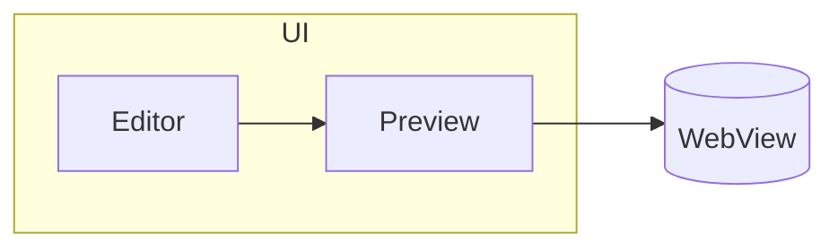

# Mixed large fixture

This file intentionally mixes many features to stress layout, scrolling, and anchor syncing.

## Table of contents

- [Headings](#headings)
- [Lists](#lists)
- [Code](#code)
- [Quotes](#quotes)
- [Table](#table)
- [Mermaid](#mermaid)
- [HTML](#html)

---

## Headings

### H3

Text with **bold**, *italic*, ~~strikethrough~~, and `inline code`.

## Lists

1. One
2. Two
   - A
     - A.1
       - A.1.a
   - B
3. Three

## Code

```swift
// Large-ish code block
enum Result<T> {
  case ok(T)
  case err(Error)
}

func work() async throws -> String {
  "done"
}
```

## Quotes

> A quote
>
> - with a list
> - and a second item

## Table

| Name | Value |
| --- | ---: |
| alpha | 1 |
| beta | 2 |
| gamma | 3 |

## Mermaid



## HTML

<div>
  <strong>Raw HTML block</strong>
  <em>should be handled consistently</em>
</div>

## Final section

A very long paragraph to test wrapping and selection. Lorem ipsum dolor sit amet, consectetur adipiscing elit, sed do eiusmod tempor incididunt ut labore et dolore magna aliqua. Ut enim ad minim veniam, quis nostrud exercitation ullamco laboris nisi ut aliquip ex ea commodo consequat.
